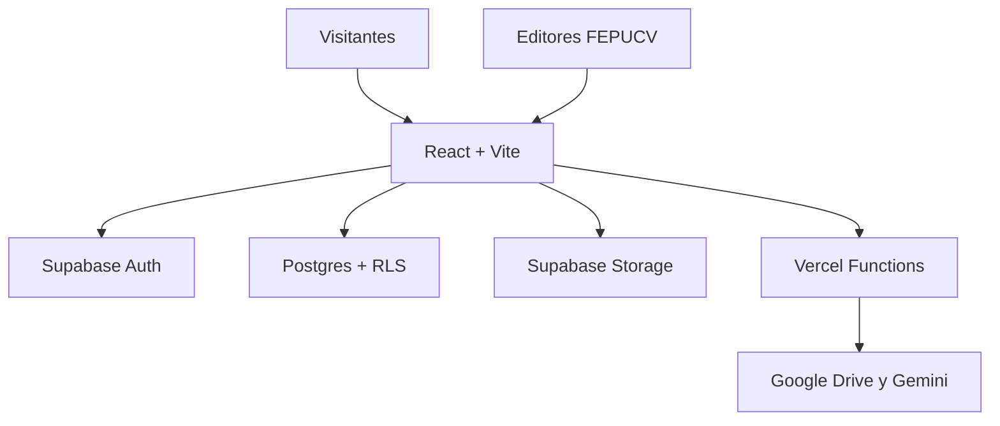

# Portal Estudiantil FEPUCV

Sitio web oficial de la Federación de Estudiantes de la Pontificia Universidad Católica de Valparaíso. Centraliza información institucional, representantes, noticias, documentos, transparencia, canales de contacto y recursos para la comunidad estudiantil.

- Sitio: [fepucv.org](https://www.fepucv.org/)
- Repositorio: [Fourdath/PaginaWebFepucv](https://github.com/Fourdath/PaginaWebFepucv)
- Despliegue: Vercel

> [!IMPORTANT]
> El panel `/admin` incluido actualmente es un prototipo. No cuenta con autenticación segura ni persistencia: no debe considerarse un sistema de administración listo para producción. La migración propuesta a Supabase está documentada en la [hoja de ruta](#hoja-de-ruta-propuesta-supabase--cms).

## Estado actual

El portal funciona como una aplicación React de una sola página, con contenido principalmente definido en archivos TypeScript y documentos enlazados desde Google Drive. También incorpora funciones serverless de Vercel para procesar rendiciones financieras y consultar documentos institucionales mediante Gemini.

### Funcionalidades implementadas

| Área | Implementación actual |
| --- | --- |
| Inicio | Presentación institucional, Mesa Ejecutiva, Consejería Superior, consejerías de facultad y acceso a fondos |
| Noticias | Listado y detalle de artículos cargados inicialmente desde `constants.tsx` |
| Consejería Superior | Perfiles, biografías, enlaces y acceso a actas |
| Facultades | Listado de facultades, representantes, carreras y enlaces de contacto |
| Documentos | Buscador de estatutos, reglamentos y manuales alojados en Google Drive |
| Transparencia | Acceso a actas, rendiciones y gráficos generados desde planillas Excel de Drive |
| Contacto | Formulario gestionado mediante un servicio externo |
| Minijuegos | Juego de fútbol integrado con integrantes de la FEPUCV |
| Asistente virtual | API basada en Gemini y documentos oficiales; interfaz temporalmente deshabilitada |
| Administración | Formulario prototipo para crear noticias solo en memoria del navegador |

El minijuego incorpora la **Copa FEPUCV**: cinco rivales con dificultad progresiva, caricaturas, controles táctiles, guardado de campaña, reinicio y top 3 local/compartido. Configuración de Supabase, arte y pruebas en [la guía del juego](docs/copa-fepucv.md).

### Rutas

| Ruta | Contenido |
| --- | --- |
| `/` | Inicio |
| `/noticias` | Noticias |
| `/noticias/:slug` | Detalle de una noticia |
| `/consejeria-superior` | Consejería Superior |
| `/facultades` | Facultades |
| `/facultades/:slug` | Detalle de una facultad |
| `/reglamentos` | Documentos y reglamentos |
| `/transparencia` | Transparencia y análisis financiero |
| `/quienes-somos` | Información institucional en desarrollo |
| `/faq` | Preguntas frecuentes |
| `/contacto` | Formulario de contacto |
| `/minijuegos` | Minijuegos |
| `/admin` | Panel administrativo experimental |

## Tecnologías

- React 19
- TypeScript
- Vite 6
- React Router
- Tailwind CSS mediante CDN
- Recharts
- SheetJS (`xlsx`)
- Vercel y Vercel Functions
- Google Drive API
- Gemini API

## Arquitectura actual

```text
Navegador
  └─ React + Vite
      ├─ Contenido estático en TypeScript
      ├─ Documentos y carpetas de Google Drive
      └─ Vercel Functions
          ├─ /api/gastos → Google Drive API + planillas Excel
          └─ /api/asistente → Google Drive + Gemini API
```

### Estructura principal

```text
.
├── api/                         # Funciones serverless de Vercel
│   ├── asistente.js
│   └── gastos.js
├── components/                  # Componentes compartidos
├── pages/                       # Páginas y rutas del portal
│   └── lib/sheetsDocs.ts        # Enlaces de documentos de Google Drive
├── public/                      # Imágenes, robots.txt y sitemap.xml
├── src/minijuegos/              # Código de los minijuegos
├── App.tsx                      # Enrutamiento y estado principal
├── constants.tsx                # Noticias, integrantes y facultades
├── types.ts                     # Tipos compartidos
├── vercel.json                  # Reescrituras para API y SPA
└── vite.config.js               # Configuración de Vite
```

## Ejecución local

### Requisitos

- Node.js 20 o superior
- npm

### Instalación

```bash
git clone https://github.com/Fourdath/PaginaWebFepucv.git
cd PaginaWebFepucv
npm ci
npm run dev
```

Vite inicia por defecto en `http://localhost:3000`.

`npm run dev` levanta solamente el frontend. Para probar también las funciones de `api/` se debe utilizar un entorno compatible con Vercel Functions, por ejemplo `vercel dev`.

### Variables de entorno actuales

Crea un archivo `.env.local` para desarrollo. No subas valores reales al repositorio.

```dotenv
# Solo servidor: usado por api/asistente.js
GEMINI_API_KEY=

# Solo servidor: usado por api/gastos.js
GOOGLE_DRIVE_API_KEY=
```

> [!CAUTION]
> Las claves privadas deben permanecer en Vercel o en el entorno del servidor. Nunca deben exponerse mediante variables `VITE_*` ni incluirse en el bundle del navegador.

### Scripts

| Comando | Uso |
| --- | --- |
| `npm run dev` | Servidor de desarrollo de Vite |
| `npm run build` | Comprobación de TypeScript y build de producción |
| `npm run preview` | Vista previa local del build |

## Edición del contenido actual

Mientras no exista un CMS persistente, los principales contenidos se modifican directamente en el código:

| Contenido | Archivo |
| --- | --- |
| Mesa Ejecutiva, consejerías, facultades y noticias iniciales | `constants.tsx` |
| Documentos, fondos, actas y carpetas de Drive | `pages/lib/sheetsDocs.ts` |
| Consejería Superior detallada | `pages/ConsejeriaSuperiorPage.tsx` |
| Textos de cada sección | Archivos de `pages/` |
| Imágenes | `public/img/` |

Después de editar:

```bash
npm run build
```

## Despliegue

El proyecto está preparado para Vercel:

- comando de build: `npm run build`;
- salida estática: `dist/`;
- las rutas `/api/*` se conservan como funciones serverless;
- las demás rutas se reescriben a `index.html` para que React Router las resuelva;
- `GEMINI_API_KEY` y `GOOGLE_DRIVE_API_KEY` deben configurarse como variables del entorno de producción.

## Auditoría técnica — 27 de agosto de 2026

La revisión se realizó sobre la rama `main`, incluyendo inspección del código, instalación limpia, build de producción, análisis de dependencias y revisión de activos.

### Resultado de las comprobaciones

| Comprobación | Resultado |
| --- | --- |
| `npm ci` | Correcto |
| `npm run build` | Correcto, con advertencia por bundle grande |
| Bundle JavaScript principal | Aproximadamente 886 kB minificado, 265 kB gzip |
| Activos públicos y build | Aproximadamente 92 MB |
| `npm audit --omit=dev` | 3 dependencias afectadas con severidad alta |
| Pruebas automatizadas | No implementadas |
| Lint y formato automatizado | No implementados |
| Integración continua | No implementada |

### Aspectos positivos

- El build de producción compila correctamente.
- La estructura por páginas y componentes es fácil de seguir.
- TypeScript entrega una base adecuada para evolucionar el proyecto.
- Vercel Functions mantiene las integraciones con Google y Gemini fuera de los componentes React.
- Existen estados de carga, error y ausencia de datos en el módulo financiero.
- El proyecto ya cuenta con `robots.txt`, `sitemap.xml`, rutas legibles y diseño adaptable.

### Hallazgos prioritarios

| Prioridad | Hallazgo | Acción recomendada |
| --- | --- | --- |
| Crítica | `/admin` valida una clave dentro del JavaScript público; no existe autenticación real, sesión segura ni control de permisos | Deshabilitar el panel actual hasta reemplazarlo por Supabase Auth y políticas RLS |
| Crítica | Las noticias creadas en `/admin` solo se guardan en el estado de React y desaparecen al recargar | Persistir noticias en una base de datos y agregar borradores/publicación |
| Alta | `npm audit` detecta vulnerabilidades altas en la versión instalada de React Router y en `xlsx` | Actualizar React Router; sustituir o aislar el procesamiento con `xlsx` y validar archivos de entrada |
| Alta | La API del asistente sigue accesible aunque la interfaz esté deshabilitada; no tiene límite de uso, autenticación ni límite explícito del cuerpo | Añadir rate limiting, validación de tamaño, control de origen y monitoreo de consumo |
| Alta | `vite.config.js` define la clave de Gemini dentro de la configuración del bundle del cliente | Eliminar esa definición y consumir la clave exclusivamente desde `api/asistente.js` |
| Media | Varias fotografías pesan entre 6 y 24 MB; `public/` suma cerca de 92 MB | Redimensionar y convertir imágenes a WebP/AVIF, eliminar archivos sin uso y usar carga diferida |
| Media | Hay rutas de imágenes inexistentes y claves de portadas que no coinciden con los `slug` de algunas facultades | Corregir las referencias y agregar una verificación automática de activos |
| Media | Existen enlaces `#`, accesos sin implementar y contenido fechado en 2024/2025 | Revisar enlaces, vigencia y responsables de actualización |
| Media | El CSS de Tailwind se carga desde CDN en producción | Integrar Tailwind en el proceso de build para mejorar control, rendimiento y política CSP |
| Media | No hay tests, lint, formato automático ni workflow de CI | Agregar ESLint, Prettier, Vitest/Testing Library y GitHub Actions |
| Media | Faltan metadatos SEO/sociales y las noticias dinámicas no se incorporan al sitemap | Añadir descripción, canonical, Open Graph, Twitter Cards y estrategia para rutas de noticias |
| Baja | El formulario de contacto depende de un tercero y los enlaces de privacidad/cookies aún no existen | Evaluar privacidad, antispam y páginas legales antes de ampliar la recolección de datos |

## Hoja de ruta propuesta: Supabase + CMS

Supabase es una evolución adecuada para que integrantes autorizados de la Federación puedan iniciar sesión y actualizar la página sin editar el repositorio. La primera entrega debería enfocarse solo en noticias; luego se pueden migrar integrantes, facultades, documentos y configuraciones.



### Experiencia administrativa recomendada

1. La FEPUCV invita cuentas editoras; no existe registro público.
2. Cada integrante inicia sesión con correo y contraseña o enlace mágico.
3. El panel muestra noticias en borrador, publicadas y archivadas.
4. Los editores pueden crear, editar, previsualizar y publicar noticias.
5. Las imágenes se suben a Storage en vez de pegar una URL externa.
6. Las acciones relevantes quedan registradas para mantener trazabilidad.

### Modelo de datos inicial

| Tabla | Propósito | Campos principales |
| --- | --- | --- |
| `profiles` | Identidad y estado del equipo editor | `id`, `display_name`, `role`, `active` |
| `news` | Noticias y comunicados | `id`, `slug`, `title`, `excerpt`, `content`, `category`, `cover_path`, `status`, `published_at`, `created_by`, timestamps |
| `audit_log` | Historial de acciones administrativas | `actor_id`, `entity`, `record_id`, `action`, `created_at` |

En fases posteriores se pueden agregar tablas para `team_members`, `faculty_representatives`, `documents`, `faqs` y `site_settings`.

### Roles sugeridos

| Rol | Permisos |
| --- | --- |
| `admin` | Gestionar editores, contenido y configuración |
| `editor` | Crear, editar y publicar contenido |
| Público | Leer exclusivamente contenido publicado |

El rol no debe ser modificable por la propia persona usuaria. Para autorización real se deben usar políticas de base de datos y, si se requiere RBAC, claims protegidos; ocultar botones o proteger una ruta en React solo mejora la interfaz, pero no protege los datos.

### Políticas mínimas de seguridad

- Activar Row Level Security en todas las tablas expuestas.
- Permitir lectura pública únicamente de noticias con estado `published`.
- Permitir escritura solo a cuentas activas con rol `editor` o `admin`.
- Reservar la gestión de usuarios y roles para `admin`.
- Permitir lectura pública de imágenes publicadas y restringir cargas, reemplazos y eliminaciones a editores.
- Usar la clave publicable de Supabase en el navegador solo junto con RLS.
- Mantener cualquier `service_role` exclusivamente en funciones del servidor y nunca en variables `VITE_*`.

### Variables futuras

Cuando Supabase se implemente:

```dotenv
VITE_SUPABASE_URL=
VITE_SUPABASE_PUBLISHABLE_KEY=

# Solo servidor; agregar únicamente si una función privilegiada lo necesita
SUPABASE_SERVICE_ROLE_KEY=
```

### Fases de implementación

#### Fase 0 — Seguridad inmediata

- Deshabilitar el panel administrativo experimental.
- Actualizar React Router.
- Resolver el uso vulnerable de `xlsx`.
- Retirar la clave de Gemini de la configuración del cliente.
- Proteger las APIs con validación, límites y monitoreo.

#### Fase 1 — Base Supabase

- Crear el proyecto de Supabase y el cliente tipado.
- Configurar Auth con cuentas por invitación.
- Crear `profiles` y `news`.
- Aplicar grants, RLS y roles.
- Migrar las noticias iniciales.

#### Fase 2 — CMS de noticias

- Proteger `/admin` con sesión real.
- Implementar listado, creación, edición, borradores, publicación y eliminación controlada.
- Incorporar subida de imágenes a Storage.
- Agregar previsualización y mensajes de éxito/error.

#### Fase 3 — Contenido institucional

- Migrar Mesa Ejecutiva, consejerías, facultades, FAQ y enlaces.
- Incorporar historial de cambios y restauración.
- Mantener Google Drive para documentos mientras siga siendo la fuente oficial, o migrarlos gradualmente a Storage.

#### Fase 4 — Calidad y rendimiento

- Optimizar imágenes y dividir el bundle por rutas.
- Integrar Tailwind al build.
- Añadir pruebas, lint, CI y monitoreo.
- Completar SEO, accesibilidad y páginas legales.

### Referencias oficiales de Supabase

- [Supabase con React](https://supabase.com/docs/guides/getting-started/quickstarts/reactjs)
- [Supabase Auth con React](https://supabase.com/docs/guides/auth/quickstarts/react)
- [Row Level Security](https://supabase.com/docs/guides/database/postgres/row-level-security)
- [Custom Claims y RBAC](https://supabase.com/docs/guides/api/custom-claims-and-role-based-access-control-rbac)
- [Control de acceso en Storage](https://supabase.com/docs/guides/storage/security/access-control)

## Flujo de contribución recomendado

1. Crear una rama por cambio.
2. No subir secretos ni archivos `.env`.
3. Ejecutar `npm ci` y `npm run build`.
4. Revisar que no existan rutas de imágenes rotas ni enlaces `#` nuevos.
5. Abrir un pull request con una descripción breve y capturas cuando el cambio sea visual.

## Licencia

El repositorio no incluye actualmente un archivo de licencia. Mientras no se defina una licencia explícita, el código conserva todos los derechos de su titular.

## Autoría y mantenimiento

Diseño y desarrollo inicial: **Matías Prado Escobar**.

Mantenimiento de contenidos: **Federación de Estudiantes PUCV**.
